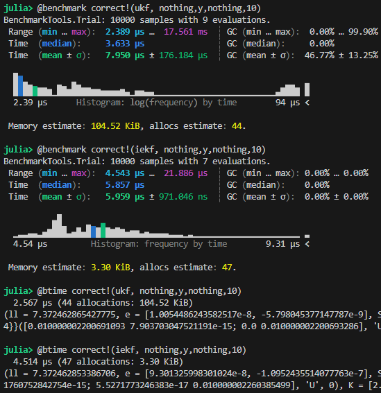

# IEKF vs UKF
This is a temporary repo to compare IEKF and UKF.

## TLDR 
When dynamics are linear, use IEKF.
              When dynamics are nonlinear use UKF. \
               UKF is more robust in prediction step, IEKF is more accurate in correction step of the filter. \
              IEKF correction step is 2 times slower than UKF correction step. (It needs to be optimized.)

## Test models
The filters will be tested on examples from article at:
https://iopscience.iop.org/article/10.1088/1742-6596/659/1/012022/pdf

An IEKF filter with fixed step-length (but not necesarily full step-length) was implemented. Step-lenght $\alpha = 0.5$ was used in simulations.

The performance is tested by running multiple simulations and then computing RMSE for each time instant (same as in the article). The computation speed benchmark was performed using @btime and @benchmark from  BenchmarkTools. Only the speed of correction step was tested.

## Bearings only tracking
The bearings only tracking model is described by
$$
x_{k+1} = x_k  + \omega_k \\
y = \begin{bmatrix}
        atan(\frac{x_2-1.5}{x_1})\\
        atan(\frac{x_2}{x_1})
    \end{bmatrix} + \nu_k \\
\omega_k \approx \mathcal{N}(0, Q) \\
\nu_k \approx \mathcal{N}(0, R)
$$

### Results:
Performance:  \
With linear dynamics and non-linear measurement, IEKF performs much better than UKF.

Q = 0.1 * I
R = 1e-4 * I \
 \
\
\
Q = 1 * I
R = 1e-4 * I \

Computational load: \

## Univariate non-stationary growth model (UNGM)
Model:
$$
x_{k+1} = 0.5x_k +25\frac{x_k}{1+x_k^2} + 8 \cos(1.2 k) + \omega_k \\
y = \frac{x^2}{20} + \nu_k \\
\omega_k \approx \mathcal{N}(0, Q) \\
\nu_k \approx \mathcal{N}(0, R)
$$
Performance: \
When dynamics are nonlinear, UKF is more robust to process noise and perform generally better than IEKF unless the noise covariances are small. When process noise is low, UKF is outperformed by IEKF. Computationally IEKF is comparable to UKF. I believe it could further be optimized.

Q = 0.01, R=0.1\
 \
\
\
Q = 0.1, R=0.1\

Computational load:
